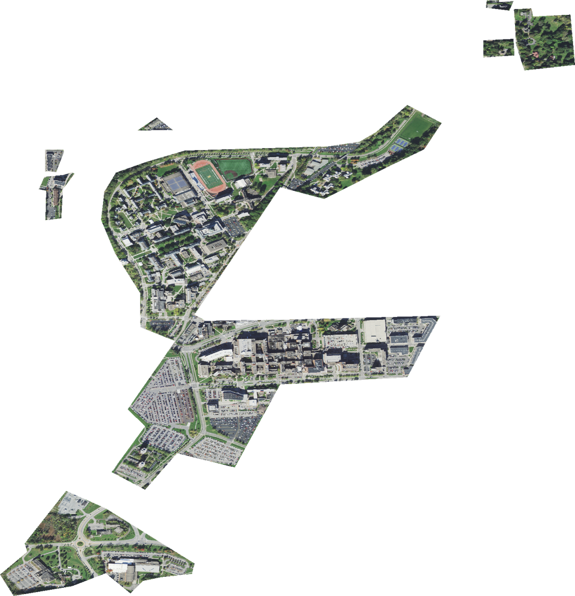

# geoimagery

[](https://pypi.org/project/geoimagery/)
[](https://pypi.org/project/geoimagery/)
[](https://github.com/hpa-code/geoimagery/actions/workflows/ci.yml)
[](LICENSE)
[](https://docs.astral.sh/ruff/)

Download high-resolution NAIP satellite imagery for **any polygon you can describe** — universities, farms, watersheds, parks, custom study areas — using Google Earth Engine. Hand it a GeoJSON or a list of shapely geometries; it hands you back GeoTIFFs clipped to your shapes.

> Originally built to harvest aerial imagery for ~3,000 U.S. universities. Generalised here so you don't have to write the same plumbing again.

<p align="center">
  
  <br>
  <em>NAIP imagery clipped to University of Rochester campus polygons — October 2021, ~0.6 m/pixel.<br>
  Imagery courtesy USDA FSA NAIP (public domain).</em>
</p>

## Features

- **Bring your own polygons.** GeoDataFrame, GeoJSON, Shapefile, GeoPackage, KML, raw shapely geometry, dict — they all work.
- **Inventory first, download second.** Find which months of NAIP exist for each shape before committing to a full download.
- **Resilient downloads.** Automatic fallback through multiple resolutions when an export hits Earth Engine's payload limit. Resumable: re-running skips files you already have.
- **Concurrent.** Thread pool for parallel inventory queries and downloads.
- **Typed.** Ships a `py.typed` marker — full mypy support out of the box.
- **MIT licensed.** Use it commercially, fork it, embed it.

## Install

### From PyPI (once published)

```bash
pip install "geoimagery[all]"
```

### From source (right now — clone + install)

```bash
git clone https://github.com/hpa-code/geoimagery
cd geoimagery
python3 -m venv .venv
source .venv/bin/activate
pip install ".[all]"
```

Either way, `[all]` pulls in the geospatial stack (geopandas, rasterio, rioxarray) plus the Earth Engine clients (earthengine-api, geemap). If you only need the pure-Python helpers you can drop the `[all]` extras.

### One-time Earth Engine setup

Each user needs their own free Google Earth Engine account and a Cloud project — credentials cannot be shared.

1. Sign up at <https://earthengine.google.com/signup/> (noncommercial use is free).
2. Create or select a [Google Cloud project](https://console.cloud.google.com/) and enable the Earth Engine API.
3. Authenticate once on your machine:

   ```bash
   earthengine authenticate
   ```

That stores a token under `~/.config/earthengine/`. You won't need to repeat it.

## Run it (no code, just a GeoJSON)

If you already have a GeoJSON, Shapefile, or GeoPackage of the polygons you care about, you don't need to write any Python — there's a bundled script that does the whole inventory + download for you:

```bash
export GEE_PROJECT=your-gcp-project-id
python examples/from_geojson.py path/to/your_areas.geojson ./naip_output
```

That will:

- build an availability inventory at `naip_output/availability.csv`
- download every available NAIP month for every polygon into `naip_output/`
- write a per-row status log at `naip_output/download_log.csv`

The script is safe to re-run — it skips files already on disk, so you can `Ctrl+C` and resume any time.

## Quickstart (Python API)

```python
import geoimagery as gi

# 1. Initialise Earth Engine (uses your stored credentials).
gi.initialize(project="my-gcp-project")

# 2. Find what's available for your areas of interest.
inventory = gi.list_available_dates(
    "my_areas.geojson",
    start_date="2022-01-01",
    end_date="2024-12-31",
)
inventory.to_csv("availability.csv", index=False)

# 3. Download every month for every area, clipped to your polygons.
results = gi.download(
    "my_areas.geojson",
    dates=inventory,
    output_dir="./naip_output",
    max_workers=5,
)
results.to_csv("download_log.csv", index=False)
```

That's it. `./naip_output/` now contains one `.tif` per (area, month), named like `area-id_area-name_June_2023.tif`.

### Single polygon, single month

```python
from shapely.geometry import box
import geoimagery as gi

gi.initialize(project="my-gcp-project")

aoi = box(-77.62, 43.12, -77.60, 43.14)  # tiny patch of Rochester, NY
gi.download(aoi, dates=["June 2023"], output_dir="./out")
```

### Already have specific months in mind?

```python
gi.download(
    my_geodataframe,
    dates=["June 2022", "August 2023", "May 2024"],
    output_dir="./out",
)
```

## Accepted geometry inputs

`load_geometries` (and every public function) will accept any of these:

| Input | Example |
|---|---|
| Path to a vector file | `"areas.geojson"`, `"areas.shp"`, `Path("areas.gpkg")` |
| GeoDataFrame | `gpd.read_file(...)` |
| Single shapely geometry | `box(xmin, ymin, xmax, ymax)` |
| List of shapely geometries | `[poly1, poly2, poly3]` |
| GeoJSON dict | `{"type": "FeatureCollection", "features": [...]}` |

If your dataframe has non-standard ID/name columns, point them out:

```python
gi.download(
    "farms.shp",
    dates=["July 2024"],
    output_dir="./out",
    id_column="FARM_ID",
    name_column="OWNER",
)
```

## Output format

For each (geometry × month) pair, the library writes a 3-band (R, G, B) GeoTIFF clipped exactly to your polygon. Filenames are `{id}_{name}_{Month}_{Year}.tif`, with unsafe characters replaced.

`download()` returns a DataFrame logging the status of every attempt: `Downloaded`, `Already Downloaded`, `No Data for Month`, `Download Failed`, or `Error: ...`. Save it as a CSV — it's invaluable for diagnosing what worked.

## Earth Engine quotas & costs

NAIP itself is **public domain** (USDA Farm Service Agency) and free to use, including commercially. Google Earth Engine has separate quotas and tiering:

- The **noncommercial tier** is free but has concurrent-request limits (~40) and per-request payload caps (~32 MB / 10k×10k pixels). geoimagery handles the payload cap by automatically falling back through 0.6 m → 1 m → 2 m → 4 m resolutions.
- For commercial use, see Google's [Earth Engine pricing page](https://earthengine.google.com/commercial/).

You are responsible for staying within the tier appropriate to your use.

## API reference

| Function | Purpose |
|---|---|
| `initialize(project=...)` | Initialise the Earth Engine client. Call once per process. |
| `list_available_dates(source, start_date, end_date)` | Return a DataFrame of NAIP months available for each input geometry. |
| `download(source, dates, output_dir, ...)` | Download clipped GeoTIFFs. |
| `load_geometries(source, ...)` | Lower-level: normalise any accepted input to a WGS84 GeoDataFrame. |
| `parse_available_dates(value)`, `build_month_window(label)`, `sanitize_filename_component(s)` | Pure-Python helpers. |

Full docstrings on every function: `python -c "import geoimagery; help(geoimagery)"`.

## Contributing

Issues, PRs, and feedback are very welcome. See [CONTRIBUTING.md](CONTRIBUTING.md) for development setup. By participating you agree to the [Code of Conduct](CODE_OF_CONDUCT.md).

## License & attribution

- This project is licensed under the **MIT License** — see [LICENSE](LICENSE).
- NAIP imagery is in the public domain, courtesy of the [USDA Farm Service Agency](https://www.fsa.usda.gov/programs-and-services/aerial-photography/imagery-programs/naip-imagery/). The customary courtesy citation when redistributing imagery is *"Imagery courtesy USDA FSA NAIP."*
- Google Earth Engine is a trademark of Google LLC. NAIP is a program of the USDA Farm Service Agency. **This project is not affiliated with, endorsed by, or sponsored by Google LLC or the USDA.** Use of the library is subject to the [Google Earth Engine Terms of Service](https://earthengine.google.com/terms/).

If you use geoimagery in academic work, please cite it via [`CITATION.cff`](CITATION.cff) (GitHub renders a "Cite this repository" button automatically).
